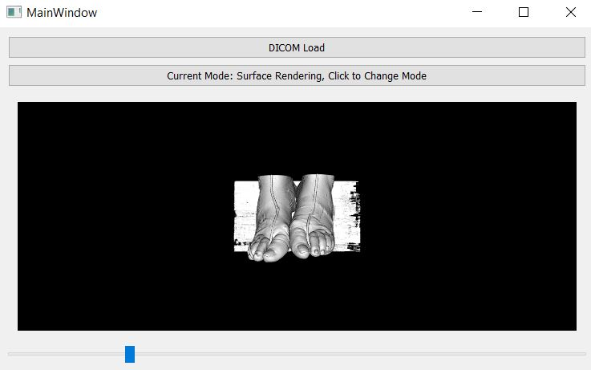
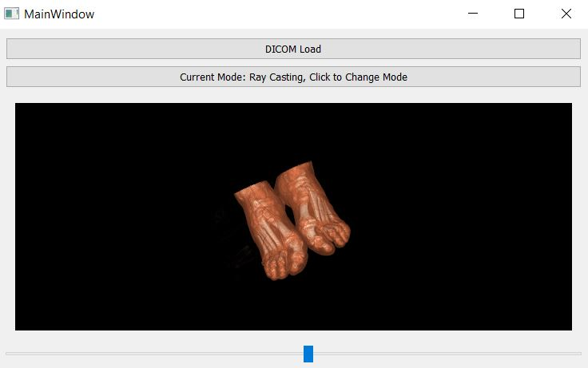
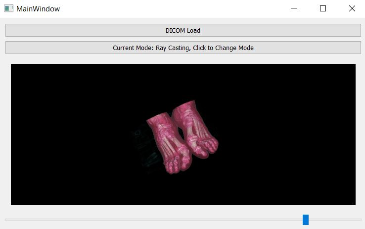

# Medical Visualization

### How to use
- Click on the DICOM Load to load the dcm slices
- There are 2 modes : Surface Rendering and Ray casting
- Toggling between modes can be done by simply pressing the mode button

- Default mode on start up is Surface Rending mode
- You can change camera view or zoom in out by iinteracting with the embedded GUI
- Changing to Ray casting can be done by pressing on the second button
- Slider is available for both modes to adjust according to user's need

